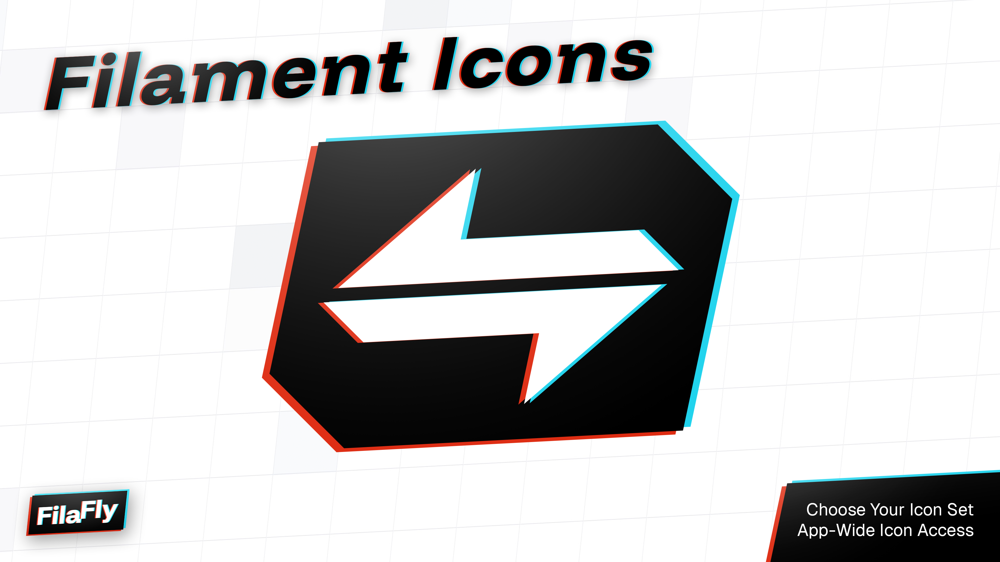

<p class="filament-hidden" align="center">
    
</p>
A package to replace Filament's default Heroicons with your preferred icon set, providing unified icon management with style variations and overrides.

# Available Icon Sets

The following icon sets are available as separate packages that work with this core package:

## Official Implementations
- [Phosphor](https://github.com/filafly/filament-phosphor-icons)
- [Font Awesome](https://github.com/filafly/filament-phosphor-icons)

## Community Implementations
- (none yet...)

# Creating Your Own Icon Set
This package allows you to create your own icon set implementations, enabling you to integrate any icon library that has a Blade Icons implementation with Filament. Here's how to get started:

## Requirements
The icon set must have a [Blade Icons](https://github.com/blade-ui-kit/blade-icons) implementation. If there isn't one, you'll need to add it yourself.

1. Create an implementation of `Filafly\FilamentIcons\IconSet` with a class name that follows the pattern `YourSetNameIcons` (replace `YourSetName` with the name of your icon set), and set the plugin ID.

```php
use Filafly\FilamentIcons\IconSet;

class PhosphorIcons extends IconSet
{
    protected string $pluginId = 'phosphor-for-filament';
}
```

2. Map all Filament icon aliases to your desired icons. Do not include any style specific string fragments such as "regular", "duotone", "-o", or "far-".

```php
protected array $iconMap = [
    'panels::global-search.field' => 'phosphor-magnifying-glass',
    'panels::pages.dashboard.actions.filter' => 'phosphor-funnel',
    'panels::pages.dashboard.navigation-item' => 'phosphor-house',
    ...
];
```

3. Add the available icon styles and the corresponding style string used by Blade Icons.

```php
protected array $styleMap = [
    'thin' => '-thin',
    'light' => '-light',
    'regular' => '',
    ...
];
```

> **Note:** The package automatically generates style-specific methods based on the keys in your `styleMap`. For example, if you have `'thin'` and `'regular'` in your style map, you can use `->thin()` and `->regular()` to set those styles.

## Optional Configuration

### Setting a default style
You can specify which style in your `styleMap` will be the default. If not specified, the first style will be used.

```php
protected string $defaultStyle = 'regular';
```

### Forcing styles
You can force specific icons to always use a particular style using the `forcedStyles` array. This overrides any style settings, including the default style and dynamic style changes. This is particularly useful when certain icons are only available in specific styles, such as brand icons that may only exist in a single style variant.

```php
protected array $forcedStyles = [
    'github' => 'brands',
];
```

### Advanced configuration
For advanced customization, you can create additional methods that can be fluently chained on your `IconSet` class. These methods can modify the internal arrays and properties to control the behavior of the icon set.

For example, you could add a `free()` method to restrict styles to only those available in the free version of an icon set:

```php
// In your icon set
public function free(): self
{
    foreach ($onlyRegularExists as $icon) {
        $this->forcedStyles[$icon] = 'regular';
    }

    return $this;
}

// In the Filament panel
...
->plugin(
    MyCoolIcons::make()->free()
)
...
```

## License

The MIT License (MIT). Please see [License File](LICENSE.md) for more information.
